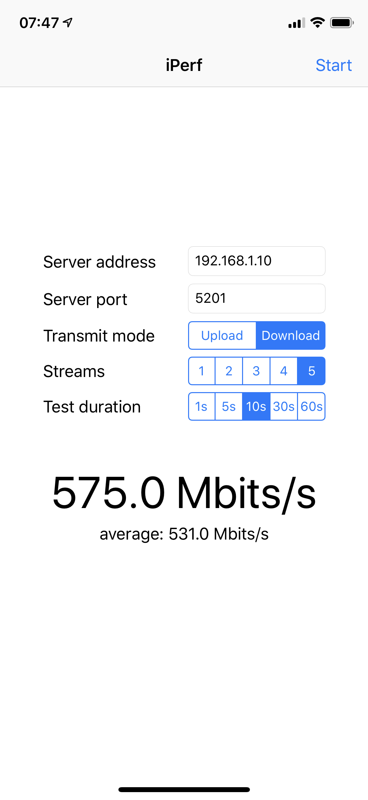

# iperf iOS

Run an [iperf3](https://iperf.fr/) client on your iPhone or iPad, including reverse mode and multiple streams selection:

Edit and run `sync.sh` to pull the latest changes from [upstream](https://github.com/esnet/iperf).

Todo:

* Save your settings
* Add a cancel button
* Compute the total test time correctly
* Graphs and progress bar
* Indefinite test duration, stop when confidence is high enough
* Nicer UI with localization
* Server mode with UPnP to allow external access
* Public iperf3 servers
* Report lost packets and stability
* Suggest number of streams
* Scan LAN for iperf servers
* Send + Receive test
* Latency test
* Switch unit from Mbits/s to MB/s when taping on the number
* Ship to the App Store
* Public database of results by device
* Guide to run a server
* MacOS version
* [Parse iOS Wifi logs](https://community.ubnt.com/t5/UniFi-Wireless/Intermittent-Connectivity-with-Apple-Devices-amp-Fast-Roaming/m-p/2353446#M297508) to diagnose roaming and connectivity issues
* Suggest expected speed from device database (number of antennas, 2.4GHz and 5GHz tests)
* Crash and error reporting
* UDP test
